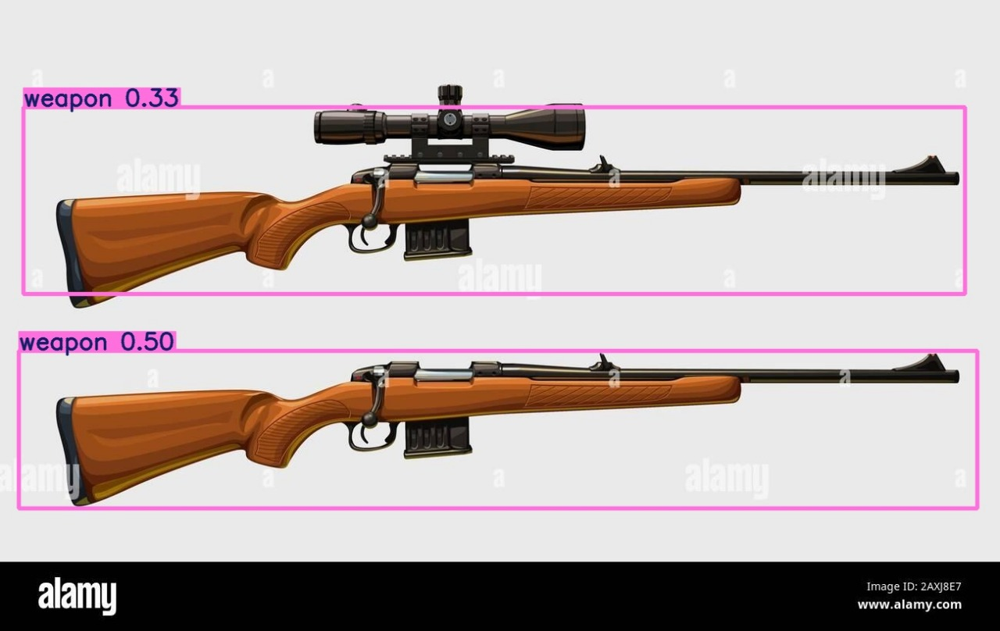
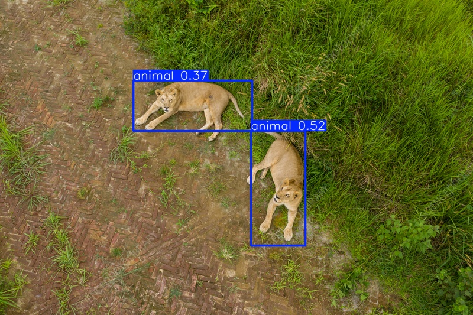
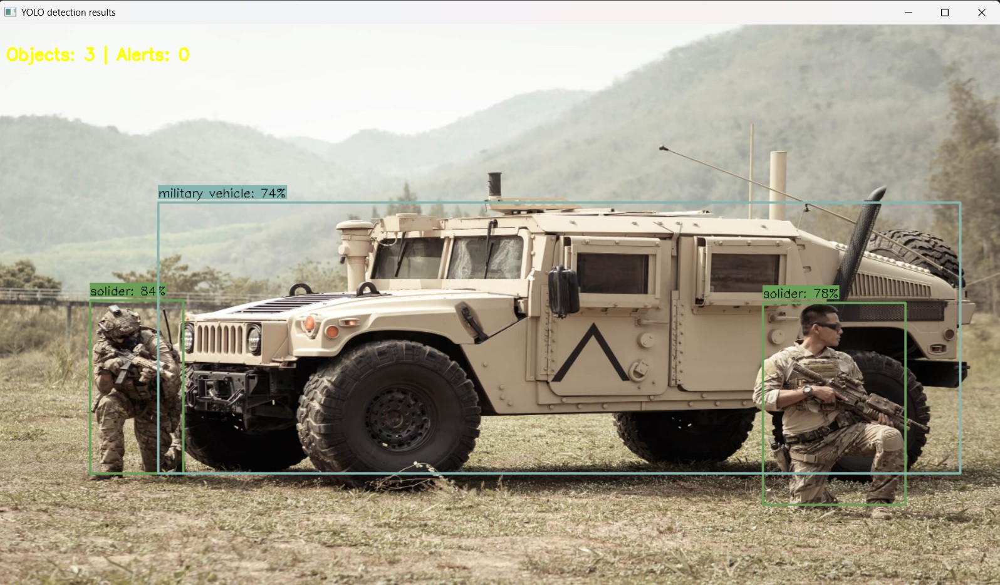
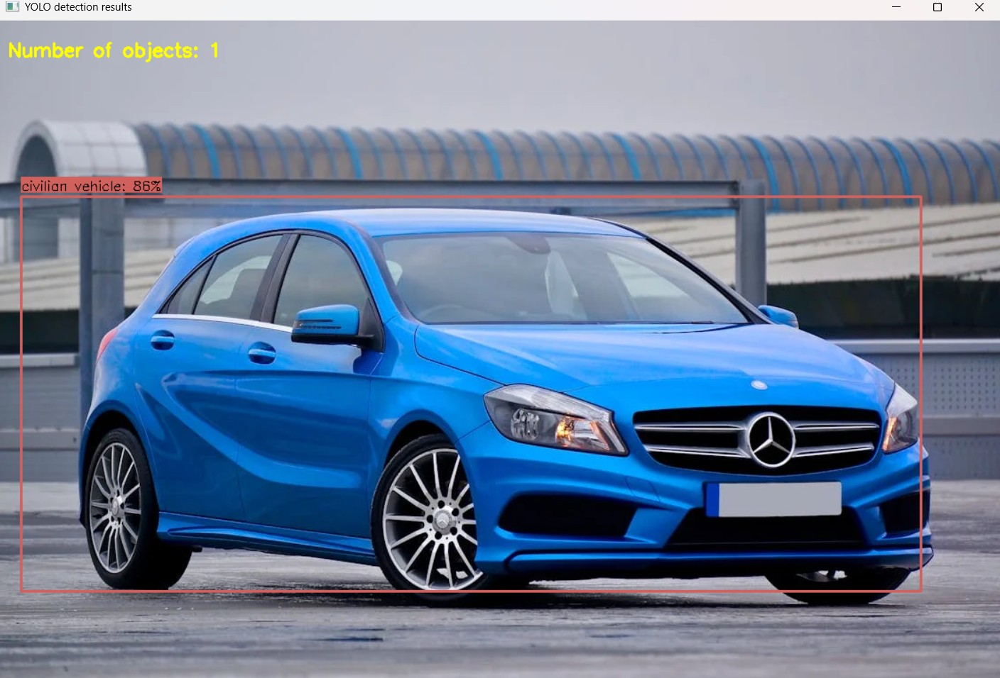

# 🛰️ Automatic Target Recognition in Aerial Surveillance (YOLOv11n)

## 📌 Overview
This project implements an **Automatic Target Recognition (ATR)** system using **YOLOv8** to detect, classify, and localize key objects (e.g., persons, vehicles, equipment) from aerial surveillance footage.  
It is designed for **defense and security use cases**, providing real-time situational awareness using drone video feeds or satellite imagery.

The system is lightweight, fast, and optimized for **deployment on edge devices** like drones, Raspberry Pi, and NVIDIA Jetson Nano.

---

## 🔍 Key Features

- 🎯 **Real-Time Object Detection**  
  Detects military and civilian targets from drone or UAV video feeds using YOLOv8.

- ⚡ **Lightweight and Fast**  
  Powered by `YOLOv11n`, suitable for edge devices with limited resources.

- 🧠 **Domain-Specific Classification**  
  Trained to distinguish between civilian vs tactical vehicles and equipment.

- 🌁 **Image Enhancement Pipeline**  
  Preprocessing includes **CLAHE** and denoising to improve low-visibility conditions.

- 🧩 **Flexible Input Sources**  
  Supports single images, folders, videos, webcams, USB cameras, and Raspberry Pi cameras.

- 📦 **Modular & Scalable Codebase**  
  Easy to extend for tracking, alert systems, or cloud integration.

---

### 📊 Training Configuration
| Parameter        | Value                    |
|------------------|--------------------------|
| Model            | YOLOv11n (nano)          |
| Dataset Size     | 374 images               |
| Optimizer        | SGD                      |
| Epochs           | 40                       |
| mAP@0.5          | ~80%                     |

---

## 📸 Example Outputs

> Below are sample results generated using our trained YOLOv8 model on aerial drone footage.

<p align="center">
  
  
</p>

<p align="center">
  
  
</p>

>🧠 Detected classes: animal, civilian, civilian vehicle, military vehicle, soldier, weapon  
>🔎 Confidence threshold: 0.5 | 🧩 Model: my_model.pt (YOLOv11n) | 🎥 Source: Drone Footage, Dataset from COCO

---

## 🛠️ Requirements

- Python 3.8 or higher
- OpenCV (`opencv-python`)
- Ultralytics YOLO (`ultralytics`)
- NumPy
- argparse (usually included in standard library)

You can install all dependencies via pip:

```bash
pip install opencv-python ultralytics numpy
